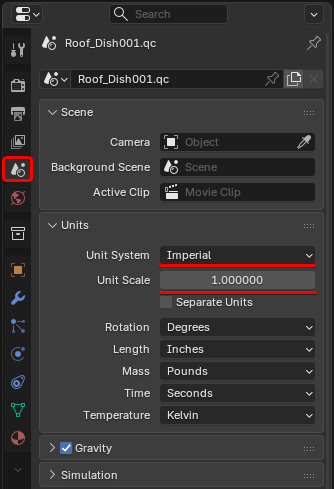
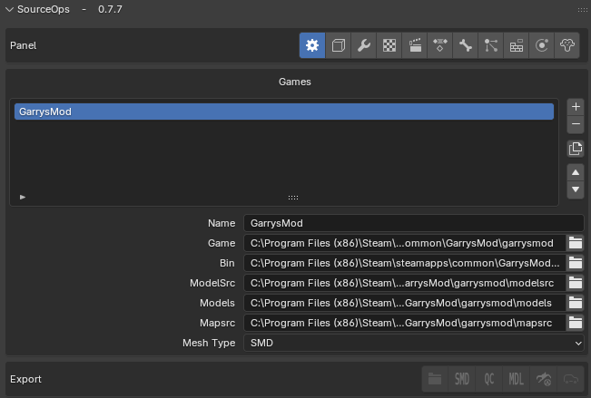
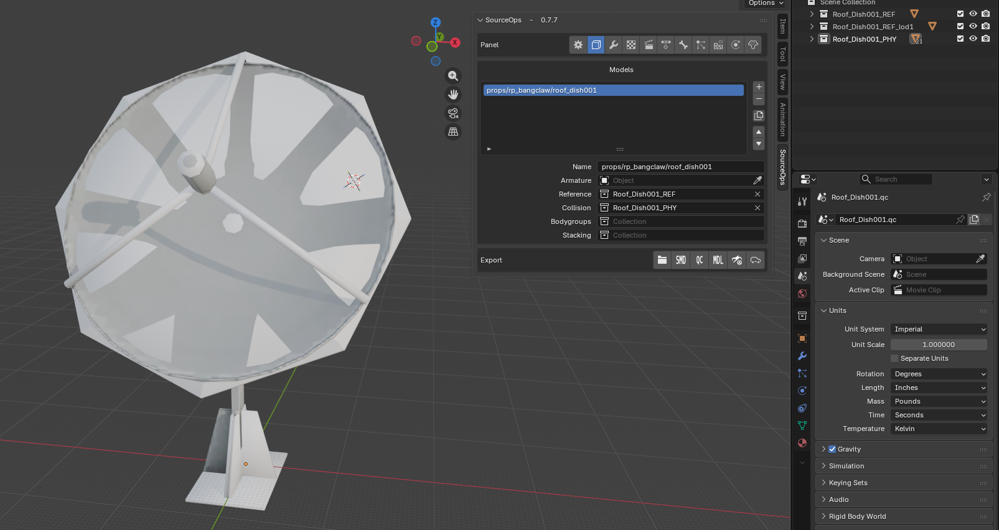

# 🗒️ Исходики исправленных моделей

### Требования

- **[Blender]** версии **5.0** и выше
- **[Crowbar]** версии **0.74**

Дополнения **Blender**

- **[BlenderSourceTools]** - для импорта моделей, карт
- **[SourceOps]** - для экспорта и компиляции моделей

Blender 5.0 полностью поменяла структуру сохранения **.blend** файла  
Обратная совместимость с ранними версиями Blender **невозможна**

### 🟠 Настройка Blender

В Source Engine **1 unit = 1 дюйм**  
Изменяем систему метрики и масштаба сцены в Blender



### ⚙️ Состав модели

Декомпилированя модель состоит из файлов формата

- `*.QC`, `*.qc`  
Главный файл для компиляции  
Содержит всю информацию о модели

- `*.SMD` `*.smd`  
Сама модель. Файлы находящиеся в папке `anims/` являются анимацией

### 📒 Именивание файлов

- `anims/idle(.SMD|.smd)`  
Папку anims можно назвать и так: `roof_dish001_anims/idle.smd`  
Главное чтобы было понятно

- `_PHY`, `_physics`  
Физическое ограничение модели  

- `_REF`, `_reference`  
Визуальные данные модели  

- `_REF_LOD`, `_reference_lod`  
Уровни детализации модели, в зависимости от расстояни от модели до игрока  
Также зависит от разрешения экрана  
Уровни нумеруются так: `_REF_LOD1` `_REF_LOD2` `_REF_LOD3` и так далее

Референс структуры файлов:

```
anims/idle.SMD						- Стандартная анимация / Пустышка
roof_dish001.qc						- Главный файл содержаший всю информацию для компиляции
roof_dish001_physics.SMD			- Визуальная часть модели
roof_dish001_reference.SMD			- Коллизия объекта
```

### ⚙️ Компиляция

Модели могут быть скомпилированы с использованием
- **[SourceOps]** - Blender дополнение для экспорта модели
- **[Crowbar]** - Универсальная программа для Source Engine

Следующие файлы **не требуются** для Garry's Mod и могут быть удалены после компиляции
- `*.dx80.vtx` - рендер DirectX 8.0
- `*.sw.vtx` - рендер DirectX ниже 8.0

Подробнее об [VTX формате](https://developer.valvesoftware.com/wiki/VTX)

Компиляция происходит с помощью [Crowbar]  
Или же с помощью [SourceOps] прямо из **Blender**  

### 🛣️ Настройка компиляции

Если у вас нет модификации [SourceOps] или же впервые скачали и хотите использовать для своих моделей  
То настройка её такая

1. Указать путь к игре

	

	Добавьте игру нажам на `+` и для поля `Game` укажите путь к `..common/GarrysMod/garrysmod`  
	Там где существуют папки **materials**, **maps**, **models**, **sounds**  
	Далее аддон подхватит остальные пути для **Bin**, **ModelSrc**, **Models**, **Mapsrc**

2. Добавить модель

	Указать название модели, если в название модели будет `/`  
	То это будет учитываться как папка, на примере название `roof_dish001`  
	При компиляции будет учитываться папка которая была указана в пути для **Models** который был указан в первом эпате  
	К примеру, если будет указано в названии `props/rp_bangclaw/roof_dish001`  
	То при компиляции путь у модели будет `garrysmod/models/props/rp_bangclaw/roof_dish001.mdl`

	Если указать просто название модели `roof_dish001`  
	То путь у модели будет `garrysmod/models/roof_dish001.mdl`

	

	Далее указать коллекцию самой модели, для удобства назовите коллецию с приставкой _REF  
	Так будет понятно что это Reference модель  
	Указать коллекцию физического коллайдера с приставкой _PHY  
	Эта модель будет указывать коллизию для _REF

3. Уровень детализации (LODs)

	Для низкополигональных моделей также требуется коллекция

4. Текстуры

	На вкладке материалов

5. Компиляция

	Здесь надо понимать что лучше всего манипулировать с декомпилированным QC файла модели, который мы ранее достали из модели с помощью [Crowbar]  
	Потому что тот QC файл который создаётся с помощью [SourceOps] это всего лишь шаблон  
	В шаблоне только базовые настройки, там нет параметров что допустим изначально были в моделе, которую вы декомпилировали

### Декомпиляция

Распаковывайте модели с помощью [Crowbar]

### Импорт модели в Blender

Для этого уже нужен другое дополнение [BlenderSourceTools]

<!-- Links -->
[Blender]: https://www.blender.org
[Crowbar]: https://github.com/ZeqMacaw/Crowbar
[SourceOPS]: https://github.com/bonjorno7/SourceOps
[BlenderSourceTools]: http://steamreview.org/BlenderSourceTools
